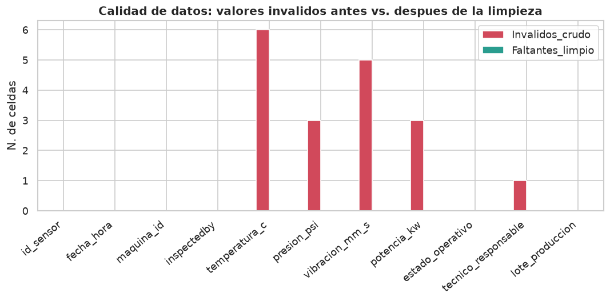
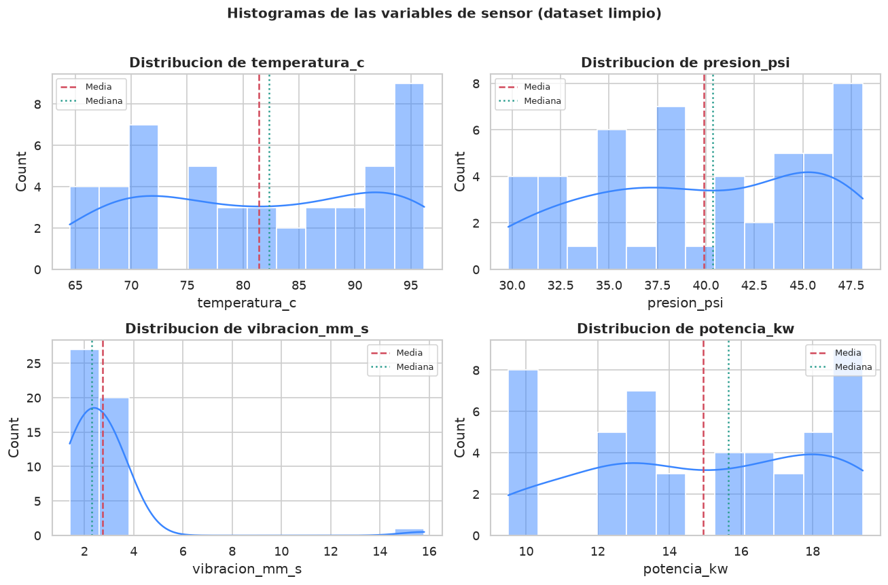
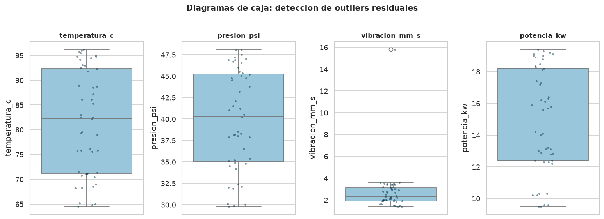
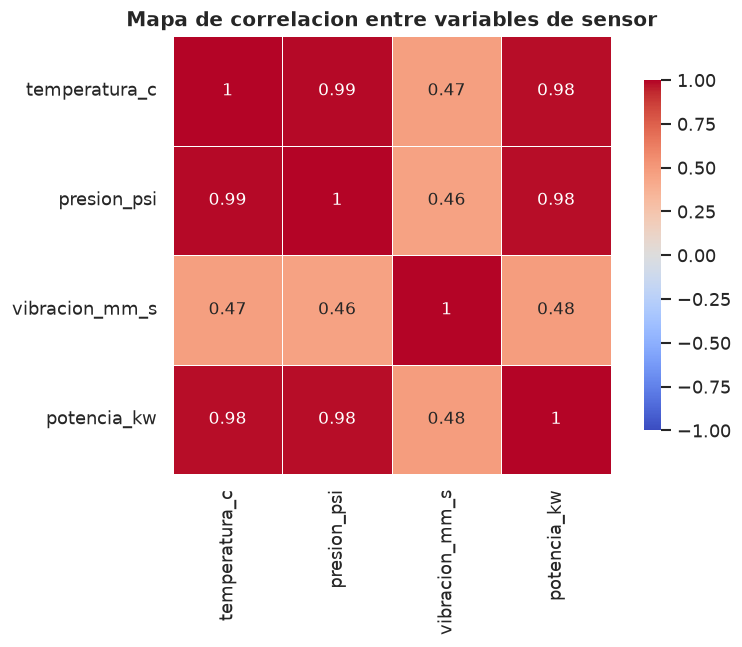
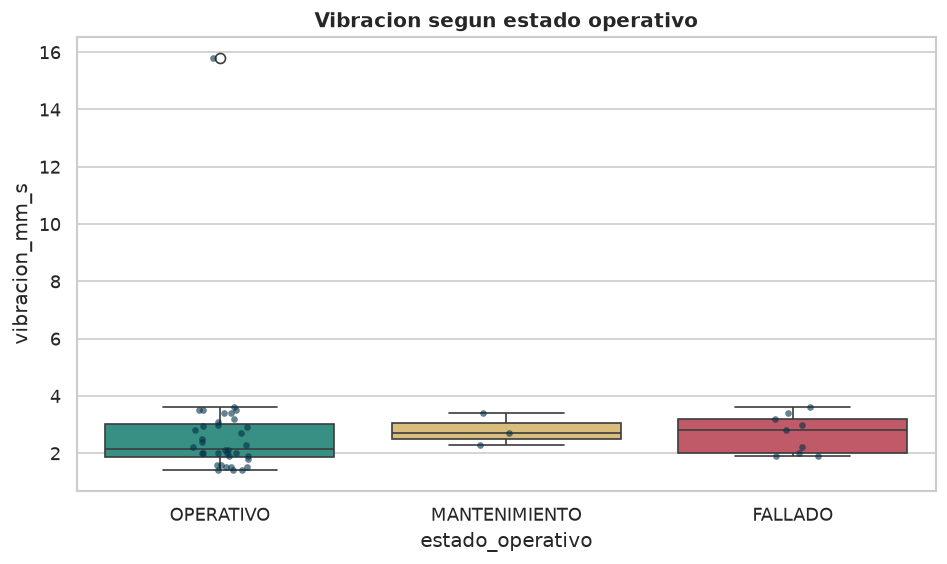

# Reporte Ejecutivo — Limpieza y Análisis Exploratorio de Datos
### Red de Sensores IoT · Industrias Metalmecánicas del Norte

**Autor:** Gabriel Emilio Herrera Balán - 202201133 · **Dataset:** `Production_RawDataSet.csv` (50 registros, 12 columnas)
**Objetivo:** identificar en la telemetría de 12 máquinas críticas (M01–M12) patrones que permitan **predecir fallos antes de que ocurran** y orientar el mantenimiento.

---

## 1. Introducción

La planta instaló sensores IoT que registran **temperatura, presión, vibración y potencia** en 12 máquinas críticas. El archivo recibido, sin embargo, llegó con los problemas típicos del mundo real: valores centinela (`999`, `999.9`, `99.9`), lecturas imposibles (vibraciones de 10 000 000 y −5 555 555 mm/s), fechas con años erróneos (2035, 2045), identificadores con ruido (`M04D`), técnicos llamados `zzzzzzzz` y lotes escritos de tres formas distintas. Sin una limpieza previa, cualquier modelo predictivo produciría conclusiones equivocadas. Este reporte documenta esa limpieza y el análisis exploratorio resultante.

Las cuatro variables de sensor son el centro del análisis: son las candidatas a convertirse en señales de alerta temprana. Las demás columnas (`id_sensor`, `fecha_hora`, `maquina_id`, `estado_operativo`, `inspectedby`, `tecnico_responsable`, `lote_produccion`) aportan contexto.

---

## 2. Componente 1 — Data Cleaning

La limpieza se hizo en Python (**pandas**) bajo tres criterios: **no inventar datos** (solo se imputó con base sólida), **respetar la línea base de cada máquina** (las imputaciones se hicieron con la mediana *por máquina*, no global, porque M08 opera a ~65 °C y M05 a ~96 °C) y **conservar el máximo de registros** (solo se eliminaron filas sin ninguna señal útil).

### Tabla de problemas encontrados y soluciones

| # | Problema | Detección | Solución | Afectados |
|---|---|---|---|---|
| 1 | Columna `time stamp` inútil | Casi constante y con minutos > 59 (`18:66:05`) | Se elimina la columna | columna completa |
| 2 | Placeholders de faltantes heterogéneos | `null`, `N/A`, vacíos, `zzzzzzzz` | Unificación a `NaN` | varias celdas |
| 3 | Formato de fecha y años fuera de rango | `D/M/YYYY` + años 2035 y 2045 | Parseo `dayfirst` + corrección del año a 2025 (typo confirmado por secuencia) | 2 fechas |
| 4 | Ruido en `maquina_id` | `M04D` en lugar de `M04` | Normalización con regex a `M##` | 2 registros |
| 5 | Faltantes en `maquina_id` (clave) | Celdas vacías | Imputación por contexto (vecinos coincidentes) | 2 registros |
| 6 | Outliers extremos y fuera de rango físico | `999`, `99.9`, negativos, `1e7`, `−5.5e6`, `0.0001` | Validación por rango físico → `NaN` | 17 lecturas |
| 7 | Filas sin ninguna lectura válida | Las 4 variables en `NaN` | Eliminación de la fila | 2 filas |
| 8 | Faltantes en sensores | `NaN` remanentes | Imputación con **mediana por máquina** | 10 valores |
| 9 | Formato inconsistente en `lote_produccion` | `LOTx001`, `LOT/001` vs `LOT-001` | Normalización con regex a `LOT-###` | 3 lotes |
| 10 | Ruido en `tecnico_responsable` | `zzzzzzzz`, `N/A`, vacíos | Etiqueta `Desconocido` | 2 registros |
| 11 | Categorías inconsistentes | Mayúsc./minúsc. mezcladas, un vacío | Estandarización de texto | columnas |
| 12 | Duplicados exactos y semánticos | Chequeo (`maquina_id`, `fecha_hora` al minuto) | Verificado: cadencia ~22–25 min, **0 duplicados** | 0 |

**Rangos físicos aplicados:** temperatura `[0, 200] °C`, presión `[0, 100] psi`, vibración `[0, 50] mm/s` (ISO 10816), potencia `[0.1, 60] kW`.

El dataset pasó de **50 a 48 registros sin un solo nulo**. La mayoría de los problemas se concentraban en las columnas de sensor, algo esperable en IoT, donde los sensores reportan `999` al perder señal.



---

## 3. Componente 2 — Análisis Exploratorio (EDA)

### 3.1 Descripción y valores faltantes

El dataset limpio tiene **48 lecturas** repartidas entre las 12 máquinas (~4 por equipo) y **cero valores faltantes**. Cada máquina opera en su propia franja: equipos como M05, M11 y M03 trabajan "calientes" (92–96 °C, ~19 kW), mientras M04 y M08 operan más fríos. Los nulos del archivo original (placeholders de texto, vacíos y centinelas) se resolvieron imputando las lecturas recuperables y eliminando las filas sin señal (figura superior).

### 3.2 Medidas de tendencia central

| Variable | Media | Mediana | Moda | Desv. | Mín | Máx | CV % |
|---|---|---|---|---|---|---|---|
| `temperatura_c` | 81.42 | 82.30 | 75.8 | 10.59 | 64.5 | 96.2 | 13.0 |
| `presion_psi` | 39.90 | 40.35 | 37.9 | 5.82 | 29.8 | 48.1 | 14.6 |
| `vibracion_mm_s` | 2.73 | 2.30 | 2.0 | 2.05 | 1.4 | 15.8 | **75.3** |
| `potencia_kw` | 14.94 | 15.65 | 9.5 | 3.28 | 9.5 | 19.4 | 21.9 |

> **Interpretación:** en temperatura, presión y potencia la media ≈ mediana (distribuciones equilibradas). La **vibración es la excepción**: su CV (75.3 %) es muy superior y su media supera a la mediana, señal de valores altos puntuales. Esa inestabilidad es justo lo que interesa vigilar en mantenimiento.

### 3.3 Histogramas y distribución



> **Interpretación:** temperatura, presión y potencia muestran distribuciones amplias por la convivencia de máquinas frías y calientes. La **vibración** se concentra entre 1.4 y 3.6 mm/s con una cola larga a la derecha: casi todas las lecturas son bajas y estables, y solo una se dispara. Esa forma es la firma típica de una variable útil para detectar anomalías.

### 3.4 Evaluación de outliers (distribución y caja de bigotes)



> **Interpretación:** tras la limpieza, temperatura, presión y potencia no tienen outliers (cajas compactas). La vibración conserva **un único outlier en 15.8 mm/s**. A diferencia de los `999` o `1e7` que se eliminaron por imposibles, este valor **sí es físicamente plausible**, por eso se conservó: no es ruido, es una señal. Distinguir "error de sensor" de "anomalía real" fue la decisión más importante de la limpieza; eliminar este punto habría borrado la evidencia más valiosa del dataset.

### 3.5 Matriz y mapa de correlación



> **Interpretación:** temperatura, presión y potencia están **casi perfectamente correlacionadas** (0.98–0.99): cuando una máquina trabaja más fuerte, consume más potencia, se calienta y sube su presión a la vez; las tres miden, en el fondo, la *carga de trabajo*. La **vibración es independiente** de ese bloque (0.46–0.48): aporta **información nueva** que las otras no capturan, lo que la convierte en la candidata ideal a indicador de salud mecánica.

---

## 4. Hallazgo clave: la vibración predice el fallo

Al ordenar cronológicamente las lecturas de **M03** aparece el patrón central del análisis:

| id_sensor | Vibración (mm/s) | Estado |
|---|---|---|
| 111 | 3.1 | OPERATIVO |
| 112 | 3.2 | OPERATIVO |
| 113 | 3.0 | OPERATIVO |
| 114 | **15.8** | OPERATIVO ← *pico anómalo* |
| 115 | 3.2 | **FALLADO** ← *fallo en la siguiente lectura* |



> **Interpretación:** la máquina vibraba estable en ~3 mm/s. En la lectura 114 la vibración saltó a 15.8 mm/s (5× su nivel normal) **mientras seguía marcada como OPERATIVO**, y en la siguiente medición ya había fallado. Es decir, **el sensor de vibración "vio venir" el fallo una lectura antes**. Con una alerta automática, mantenimiento habría tenido ventana para intervenir antes de la parada.

---

## 5. Conclusiones

1. Los datos crudos eran inutilizables tal cual: cerca de un tercio de las celdas críticas tenían algún problema.
2. El dataset limpio (48 registros, sin nulos, tipos correctos) ya está listo para alimentar un modelo predictivo.
3. **Temperatura, presión y potencia son redundantes entre sí** (~0.98); para un modelo basta una de ellas como medida de carga.
4. **La vibración es la variable más valiosa**: independiente del resto y capaz de anticipar un fallo (caso M03).
5. La tasa de fallo observada (**19 %**, 9 de 48 lecturas) es alta y respalda económicamente el mantenimiento predictivo.

## 6. Recomendaciones para mantenimiento predictivo

1. **Alerta automática por vibración**, con umbral relativo a la línea base histórica de cada máquina (p. ej. 2–3×). El caso M03 muestra que da tiempo de reacción.
2. **Umbrales por máquina, no globales**: un único umbral generaría falsas alarmas en las máquinas calientes y pasaría por alto las frías.
3. **Corregir los centinelas en el origen**: configurar la telemetría para enviar un nulo explícito en vez de `999`, para no contaminar los cálculos.
4. **Aumentar la frecuencia de muestreo** en equipos críticos: con lecturas cada ~25 min, una anomalía puede volverse fallo entre una medición y la siguiente.
5. **Construir el modelo priorizando la vibración** como predictor principal + una variable de carga; etiquetar cada lectura según si fue seguida de un fallo y entrenar un clasificador.

---

## 7. Apéndice — Código

Todo el proceso (limpieza + EDA + figuras) está en **`analisis_sensores.py`**, comentado y reproducible. Genera `sensores_limpios.csv` y la carpeta `figuras/`. Núcleo de la limpieza:

```python
# Rangos físicos plausibles; lo que cae fuera (999, 99.9, negativos, 1e7, 0.0001) -> NaN
RANGOS = {"temperatura_c": (0,200), "presion_psi": (0,100),
          "vibracion_mm_s": (0,50), "potencia_kw": (0.1,60)}
for c, (lo, hi) in RANGOS.items():
    df.loc[df[c].notna() & ((df[c] < lo) | (df[c] > hi)), c] = np.nan

# Imputación con la MEDIANA POR MAQUINA (respeta la línea base de cada equipo)
for c in COLS_SENSOR:
    df[c] = df.groupby("maquina_id")[c].transform(lambda s: s.fillna(s.median()))
```

**Entregables:** `analisis_sensores.py` · `sensores_limpios.csv` (48 registros, sin nulos) · `figuras/` (visualizaciones). *Reproducir con:* `python analisis_sensores.py`
